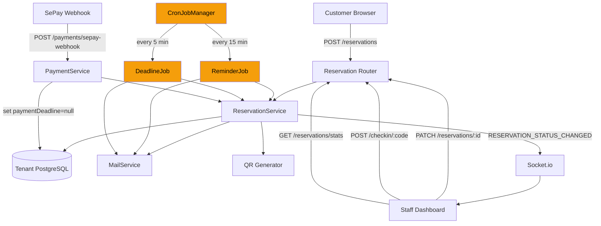
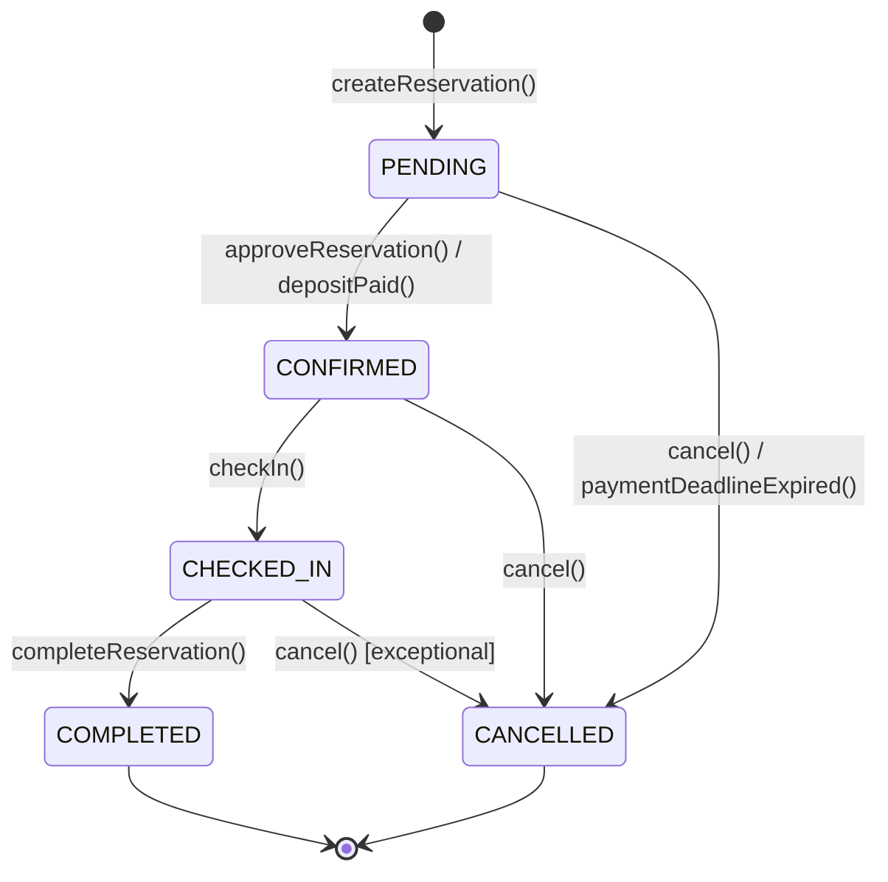

# Design Document — Reservation Enhancement

## Overview

Bản nâng cấp này mở rộng hệ thống đặt bàn của XFOODI, giải quyết 10 vấn đề tồn đọng trong luồng hiện tại: thiếu email notification đầy đủ, trạng thái vòng đời không đủ (CHECKED\_IN/COMPLETED), logic check-in sai trạng thái, thiếu date range filter, thiếu cron job nhắc nhở và enforce deadline, không hỗ trợ chỉnh sửa reservation, không có hoàn cọc khi hủy, thiếu stats dashboard, thiếu QR check-in, và `paymentDeadline` chưa được sử dụng.

Kiến trúc giữ nguyên multi-tenant theo restaurant slug, sử dụng `prismaStorage` (AsyncLocalStorage) để routing đến đúng tenant DB. Các thay đổi được phân chia thành 4 nhóm: **DB schema**, **Backend service/route**, **Cron jobs**, và **Frontend components**.

**Tech stack tóm tắt:**

| Layer | Công nghệ |
|---|---|
| Frontend | Next.js 15 + TypeScript + Ant Design 6 |
| Backend | Node.js + Express 5 + Prisma ORM 6 + PostgreSQL |
| Email | SendGrid (`@sendgrid/mail`) |
| QR | `qrcode` library (đã có trong dependencies) |
| Cron | `node-cron` (cần thêm vào dependencies) |
| Real-time | Socket.io |
| Payment | SePay webhook |
| Testing | Jest + `fast-check` (BE property tests), React Testing Library (FE) |

---

## Architecture

### High-Level Flow



### Status State Machine



Mọi transition ngoài sơ đồ trả về HTTP 422.

---

## Components and Interfaces

### Backend — Thay đổi và thêm mới

#### 1. `ReservationService` (mở rộng)

```typescript
// Thêm các method mới vào class ReservationService

// Validate và thực thi transition theo state machine
validateTransition(from: string, to: string): void
// Throws HTTP 422 nếu không hợp lệ

// Fix checkIn() — đổi từ CONFIRMED sang CHECKED_IN
async checkIn(code: string, actorId?: string): Promise<Reservation>

// Thêm complete() — CHECKED_IN → COMPLETED
async completeReservation(id: string, actorId?: string): Promise<Reservation>

// Mới: PATCH /reservations/:id
async updateReservation(id: string, dto: UpdateReservationDto, actorId?: string): Promise<Reservation>

// Mới: GET /reservations/stats
async getStats(restaurantId: string, period: 'today' | 'this_week' | 'this_month'): Promise<ReservationStats>

// Mới: auto-cancel overdue PENDING
async autoExpirePaymentDeadlines(): Promise<void>

// Mới: find reservations needing reminder
async findReservationsNeedingReminder(): Promise<Reservation[]>
async markReminderSent(id: string): Promise<void>

// Mở rộng cancel() để xử lý refund
async cancel(id: string, actorId?: string): Promise<Reservation>
```

**Status Transition Map (hard-coded):**
```typescript
const ALLOWED_TRANSITIONS: Record<string, string[]> = {
  PENDING:     ['CONFIRMED', 'CANCELLED'],
  CONFIRMED:   ['CHECKED_IN', 'CANCELLED'],
  CHECKED_IN:  ['COMPLETED', 'CANCELLED'],
  COMPLETED:   [],
  CANCELLED:   [],
};
```

**statusHistory trong metadata:**
Mỗi transition append một entry vào `reservation.metadata.statusHistory`:
```json
{ "from": "PENDING", "to": "CONFIRMED", "at": "2025-01-15T10:30:00Z", "by": "user-id" }
```

#### 2. `MailService` (mở rộng `lib/email.ts`)

Thêm 4 hàm mới vào `src/lib/email.ts`:

```typescript
export interface ReservationEmailDetails {
  restaurantName: string;
  confirmationCode: string;
  numberOfGuests: number;
  time: string;         // ISO string
  depositAmount: number;
  tableAssignments?: string[];   // e.g. ["A1", "A2"]
  specialRequests?: string;
}

// Email xác nhận đặt bàn (mở rộng hàm hiện có)
export const sendReservationConfirmationEmail: (
  to: string,
  details: ReservationEmailDetails
) => Promise<void>

// Email hủy reservation
export const sendReservationCancellationEmail: (
  to: string,
  details: ReservationEmailDetails & {
    cancelledAt: string;
    refundAmount?: number;
    refundEstimateDays?: number;
  }
) => Promise<void>

// Email nhắc nhở trước 2 tiếng
export const sendReservationReminderEmail: (
  to: string,
  details: ReservationEmailDetails
) => Promise<void>

// Email thông báo hoàn cọc
export const sendRefundNotificationEmail: (
  to: string,
  details: {
    restaurantName: string;
    confirmationCode: string;
    refundAmount: number;
    estimatedDays: number;
    reason?: string;
  }
) => Promise<void>
```

**Retry logic:** Mỗi hàm email được wrap bởi helper `sendWithRetry(fn, maxAttempts=3, delayMs=10000)`:
```typescript
async function sendWithRetry<T>(
  fn: () => Promise<T>,
  maxAttempts: number = 3,
  delayMs: number = 10_000
): Promise<T>
```

Nếu thất bại sau 3 lần, ghi `NotificationLog` record (trong Prisma model hoặc bảng riêng) với `{ reservationId, email, reason, attempts: 3, status: 'FAILED' }`.

#### 3. `QRService` (mới)

```typescript
// src/services/qr.service.ts
import QRCode from 'qrcode';

export async function generateReservationQR(confirmationCode: string): Promise<string> {
  // Tạo QR embed chỉ confirmationCode
  return QRCode.toDataURL(confirmationCode, { errorCorrectionLevel: 'M', width: 256 });
}
```

QR URL được store vào `reservation.metadata.qrCodeUrl`. Nếu generation fails, log lỗi và để `null` — reservation vẫn được tạo thành công.

#### 4. `CronJobManager` (mới)

```typescript
// src/cron/reservationCron.ts
import cron from 'node-cron';

export function startReservationCronJobs(): void {
  // Reminder job: every 15 minutes
  cron.schedule('*/15 * * * *', runReminderJob);

  // Payment deadline enforcement: every 5 minutes
  cron.schedule('*/5 * * * *', runDeadlineJob);
}
```

Được gọi trong `src/index.ts` sau khi server start:
```typescript
import { startReservationCronJobs } from './cron/reservationCron';
// ...
server.listen(PORT, () => {
  startReservationCronJobs();
  // ...
});
```

**ReminderJob logic:**
1. Query reservations: `status = CONFIRMED`, `reminderSentAt IS NULL`, `time BETWEEN (now + 105min) AND (now + 135min)`, `restaurant.isActive = true`
2. Với mỗi reservation: fetch customer email → `sendReservationReminderEmail()` → set `reminderSentAt = now`
3. Nếu email fail: log `{ attempt: 1, reservationId, failedAt }` vào metadata; không set `reminderSentAt` → sẽ retry trên lần chạy tiếp theo
4. Nếu retry cũng fail: log `{ attempt: 2, failedAt }`, đánh dấu `reminderFailed: true` trong metadata

**DeadlineJob logic:**
1. Query reservations: `status = PENDING`, `paymentDeadline IS NOT NULL`, `paymentDeadline < now`
2. Với mỗi reservation:
   - Gọi `cancel(id, 'SYSTEM')` với reason `'Payment deadline exceeded'`
   - Append `{ cancelledReason: 'Payment deadline exceeded', at: now }` vào metadata
   - Release table assignments (xóa `ReservationTable` records hoặc update status)
   - Gửi `sendReservationCancellationEmail()`
3. Emit `RESERVATION_AUTO_CANCELLED` socket event đến `restaurant_{restaurantId}`

#### 5. API Routes — Thêm mới

```typescript
// PATCH /reservations/:id — update reservation fields
router.patch('/:id', authMiddleware, requireRole('Owner', 'Admin', 'Staff', 'Customer'), updateReservationHandler);

// GET /reservations/stats — dashboard statistics
router.get('/stats', authMiddleware, requireRole('Owner', 'Admin', 'Staff'), getStatsHandler);

// POST /reservations/:id/complete — mark COMPLETED
router.post('/:id/complete', authMiddleware, requireRole('Owner', 'Admin', 'Staff'), completeReservationHandler);
```

> **Lưu ý thứ tự route:** `/stats` phải được đăng ký **trước** `/:id` để tránh Express match nhầm.

---

### Frontend — Thay đổi và thêm mới

#### 1. `reservationService.ts` (mở rộng)

```typescript
// Thêm vào reservationService
update(id: string, dto: UpdateReservationDto): Promise<Reservation>
getStats(restaurantId: string, period: StatsPeriod): Promise<ReservationStats>
complete(id: string): Promise<Reservation>
```

**Thêm types:**
```typescript
export interface UpdateReservationDto {
  numberOfGuests?: number;
  time?: string;
  tableIds?: string[];
  specialRequests?: string;
}

export type StatsPeriod = 'today' | 'this_week' | 'this_month';

export interface ReservationStats {
  totalReservations: number;
  confirmedCount: number;
  checkedInCount: number;
  completedCount: number;
  cancelledCount: number;
  checkInRate: number;
  totalDepositCollected: number;
}
```

**Thêm `API_ROUTES`:**
```typescript
UPDATE: (id: string) => `/reservations/${id}`,
STATS: '/reservations/stats',
COMPLETE: (id: string) => `/reservations/${id}/complete`,
```

#### 2. `reservations/page.tsx` (mở rộng)

**Thêm vào STATUS\_OPTIONS:**
```typescript
{ value: "CHECKED_IN", label: "Đã check-in" },
{ value: "COMPLETED", label: "Hoàn thành" },
```

**Thêm vào STATUS\_COLOR:**
```typescript
CHECKED_IN: "#6366f1",   // indigo
COMPLETED: "#3b82f6",    // blue
```

**Thêm Date Range Filter:**
```tsx
<DatePicker.RangePicker
  value={dateRange}
  onChange={(range) => { setDateRange(range); setPage(1); }}
  format="DD/MM/YYYY"
  placeholder={["Từ ngày", "Đến ngày"]}
  style={{ width: 280 }}
/>
```
Validation: nếu `from > to`, hiển thị inline error và không submit.

**Thêm Stats Cards component:**
```tsx
<StatsCards restaurantId={restaurantId} />
// Auto-refresh mỗi 5 phút, retain last values on failure
```

**Thêm "Hoàn thành" button cho CHECKED\_IN:**
```tsx
{r.statusValue?.code === "CHECKED_IN" && (
  <Button size="small" onClick={() => handleComplete(r.id)}
    style={{ background: "#3b82f6", color: "#fff" }}>
    ✓ Hoàn thành
  </Button>
)}
```

#### 3. `reservations/[id]/page.tsx` (mở rộng)

**Thêm Edit Form** (visible only for PENDING/CONFIRMED):
```tsx
{(res.statusValue?.code === "PENDING" || res.statusValue?.code === "CONFIRMED") && (
  <EditReservationForm
    reservation={res}
    onSave={handleUpdate}
  />
)}
```

**Thêm QR Scanner Check-in button:**
```tsx
{res.statusValue?.code === "CONFIRMED" && (
  <QRScannerModal
    onSuccess={(code) => handleCheckInByCode(code)}
    onClose={() => setShowQR(false)}
  />
)}
```

**Thêm Refund Info Section:**
```tsx
{res.refund && (
  <RefundInfoCard
    amount={res.refund.amount}
    status={res.refund.status}
    estimatedDays={res.refund.estimatedDays}
  />
)}
```

**Thêm CHECKED\_IN actions:**
```tsx
{res.statusValue?.code === "CHECKED_IN" && (
  <Button onClick={handleComplete} style={{ background: "#3b82f6" }}>
    ✓ Đóng reservation
  </Button>
)}
```

#### 4. `reservations/new/page.tsx` (mở rộng — Step 3)

**Thêm QR Code display:**
```tsx
{createdCode && reservation?.metadata?.qrCodeUrl && (
  <div style={{ textAlign: "center", marginBottom: 20 }}>
    
    <p style={{ fontSize: 12, color: "var(--text-muted)" }}>
      Khách hàng có thể quét QR này để check-in
    </p>
  </div>
)}
```

**Thêm Payment Deadline Countdown:**
```tsx
{reservation?.paymentDeadline && !depositPaid && (
  <PaymentDeadlineCountdown
    deadline={reservation.paymentDeadline}
    onExpired={() => showToast("warning", "Hết hạn", "Thời gian thanh toán cọc đã hết")}
  />
)}
```

#### 5. Components mới

**`QRScannerModal`** (`components/reservations/QRScannerModal.tsx`):
- Sử dụng `getUserMedia` API
- Decode QR liên tục (dùng `@zxing/library` hoặc `jsQR`)
- Auto-timeout sau 60 giây không decode được
- Fallback manual form nếu camera bị từ chối
- Torch toggle nếu device hỗ trợ `torch` constraint
- Validate regex `^[0-9A-F]{6}$` trước khi submit

**`StatsCards`** (`components/reservations/StatsCards.tsx`):
- Display 5 stat cards: Tổng đặt bàn, Đã xác nhận, Đã check-in, Hoàn thành, Đã hủy
- Hiển thị Check-in Rate và Doanh thu cọc
- Refresh mỗi 5 phút (setInterval)
- Retain last values on error + show non-blocking warning

**`PaymentDeadlineCountdown`** (`components/reservations/PaymentDeadlineCountdown.tsx`):
- Nhận `deadline: string` (ISO) và `onExpired: () => void`
- Update every second using `setInterval`
- Hiển thị MM:SS countdown
- Hide khi `deadline` cleared (payment received)

**`EditReservationForm`** (`components/reservations/EditReservationForm.tsx`):
- Fields: `numberOfGuests`, `time` (DateTimePicker), `tableIds` (multi-select), `specialRequests`
- Gọi availability check khi time hoặc tables thay đổi
- Submit gọi `reservationService.update()`

---

## Data Models

### Prisma Schema Changes

```prisma
model Reservation {
  id                  String    @id @default(uuid())
  customerId          String
  restaurantId        String
  numberOfGuests      Int
  time                DateTime
  specialRequests     String?
  depositAmount       Decimal   @db.Decimal(18, 2)
  checkedInAt         DateTime?
  completedAt         DateTime?     // THÊM MỚI — set khi status → COMPLETED
  reminderSentAt      DateTime?     // THÊM MỚI — set khi reminder email gửi
  createdAt           DateTime  @default(now())
  updatedAt           DateTime  @updatedAt
  createdBy           String?
  modifiedBy          String?
  reservationStatusId String
  confirmationCode    String?   @unique
  metadata            Json?     // chứa qrCodeUrl, statusHistory, cancellationInfo
  paymentDeadline     DateTime?

  // relations giữ nguyên...
}
```

**Migration SQL (2 cột mới):**
```sql
ALTER TABLE "Reservations" ADD COLUMN "completedAt" TIMESTAMP;
ALTER TABLE "Reservations" ADD COLUMN "reminderSentAt" TIMESTAMP;
```

### metadata JSON structure

```typescript
interface ReservationMetadata {
  qrCodeUrl?: string | null;
  statusHistory?: StatusHistoryEntry[];
  cancellationInfo?: {
    cancelledReason?: string;
    at?: string;
    fee_percentage?: number;
    fee_reason?: string;
    cancellation_timestamp?: string;
  };
  reminderRetries?: { attempt: number; failedAt: string }[];
}

interface StatusHistoryEntry {
  from: string;
  to: string;
  at: string;  // ISO 8601 UTC
  by: string;  // userId or 'SYSTEM'
}
```

### StatusValue Seeds (thêm 2 records)

```typescript
// Cần thêm vào DB seed script
const newStatuses = [
  { code: 'CHECKED_IN', name: 'Đã check-in', colorCode: '#6366f1', statusType: { code: 'RESERVATION' } },
  { code: 'COMPLETED',  name: 'Hoàn thành',  colorCode: '#3b82f6', statusType: { code: 'RESERVATION' } },
];
```

### Refund Model (mới nếu không tồn tại)

Nếu Prisma schema chưa có model `Refund`, cần thêm:

```prisma
model Refund {
  id            String   @id @default(uuid())
  reservationId String
  amount        Decimal  @db.Decimal(18, 2)
  status        String   @default("PENDING")  // PENDING | PROCESSING | COMPLETED | FAILED
  metadata      Json?
  createdAt     DateTime @default(now())
  updatedAt     DateTime @updatedAt

  reservation Reservation @relation(fields: [reservationId], references: [id])
  payments    Payment[]   // linked payment records

  @@index([reservationId])
  @@map("Refunds")
}
```

Nếu đã tồn tại model khác phục vụ mục đích này, tái sử dụng thay vì tạo mới.

---

## Correctness Properties

*A property is a characteristic or behavior that should hold true across all valid executions of a system — essentially, a formal statement about what the system should do. Properties serve as the bridge between human-readable specifications and machine-verifiable correctness guarantees.*

### Property 1: Email Content Completeness

*For any* valid `Reservation` object, the rendered confirmation email HTML string SHALL contain the `confirmationCode`, the formatted `time`, `numberOfGuests`, `restaurantName`, and `depositAmount`; and if `tableAssignments` is non-empty, the email SHALL also contain at least one table code.

**Validates: Requirements 1.2, 1.4**

---

### Property 2: Email Retry Bound

*For any* email send attempt that consistently fails, the `sendWithRetry` helper SHALL attempt delivery at most 3 times total before marking the notification as FAILED; it SHALL never attempt more than 3 times for a single notification event.

**Validates: Requirements 1.7, 1.3**

---

### Property 3: Status Transition Enforcement

*For any* reservation in state S and any requested next state S', if (S, S') is not in the allowed transition set `{(PENDING,CONFIRMED),(PENDING,CANCELLED),(CONFIRMED,CHECKED_IN),(CONFIRMED,CANCELLED),(CHECKED_IN,COMPLETED),(CHECKED_IN,CANCELLED)}`, then the system SHALL reject the request with HTTP 422 containing `{ error: "Invalid transition", from: S, to: S' }`.

**Validates: Requirements 2.2, 2.3**

---

### Property 4: Status History Append Invariant

*For any* reservation that undergoes N valid status transitions, `metadata.statusHistory` SHALL have exactly N entries, each containing `{from, to, at, by}`, and the entries SHALL be in chronological order by `at` timestamp.

**Validates: Requirements 2.4**

---

### Property 5: completedAt Set on COMPLETED Transition

*For any* reservation, when its status transitions to COMPLETED, `completedAt` SHALL be non-null and SHALL equal approximately the current UTC time (within 5 seconds of the transition call).

**Validates: Requirements 2.5**

---

### Property 6: Check-In Produces CHECKED_IN (not CONFIRMED)

*For any* CONFIRMED reservation R and its exact `confirmationCode`, calling `checkIn(confirmationCode)` SHALL return a reservation with `status.code === 'CHECKED_IN'` and `checkedInAt` set to approximately the current time. The returned status SHALL never be `'CONFIRMED'`.

**Validates: Requirements 3.1**

---

### Property 7: Availability Filter — No Double-Booking

*For any* two non-CANCELLED reservations R1 and R2 at the same restaurant assigned to the same table, `|R1.time − R2.time|` SHALL be strictly greater than 90 minutes. Equivalently, the availability check SHALL never return a table that already has a non-CANCELLED reservation within [T−90min, T+90min].

**Validates: Requirements 13.1, 13.4**

---

### Property 8: Availability Filter — Capacity and Active Constraints

*For any* availability query with parameter `numberOfGuests = G`, all returned tables SHALL satisfy `seatingCapacity >= G` AND `isActive === true`. No table with `seatingCapacity < G` or `isActive === false` SHALL ever appear in the result set.

**Validates: Requirements 13.2**

---

### Property 9: Availability Check Idempotence

*For any* `(restaurantId, time, numberOfGuests)` triple, calling `checkAvailability` twice in sequence with no intervening reservation changes SHALL return the identical set of table IDs both times.

**Validates: Requirements 13.5**

---

### Property 10: Deposit Calculation — Linear Scaling (Table Case)

*For any* non-empty list of tables `[t1, t2, ..., tN]` with seating capacities `[c1, c2, ..., cN]` (each ≥ 1), the calculated `depositAmount` SHALL equal `(c1 + c2 + ... + cN) × 25000`. This holds regardless of the order of tables or number of tables.

**Validates: Requirements 11.1, 11.5**

---

### Property 11: Deposit Calculation — Linear Scaling (No-Table Case)

*For any* integer `numberOfGuests >= 1`, when no `tableIds` are provided, the calculated `depositAmount` SHALL equal `numberOfGuests × 25000`.

**Validates: Requirements 11.2**

---

### Property 12: Deposit Calculation Non-Negativity

*For any* valid reservation input (numberOfGuests ≥ 1, seatingCapacity ≥ 1, unitPrice = 25000), the calculated `depositAmount` SHALL always be ≥ 0. The system SHALL never persist a reservation with `depositAmount < 0`.

**Validates: Requirements 11.3**

---

### Property 13: Deposit Recalculation Idempotence

*For any* update payload `{numberOfGuests, tableIds}`, the `depositAmount` after updating a reservation SHALL be identical to the `depositAmount` that would result from creating a fresh reservation with the same `{numberOfGuests, tableIds}` values.

**Validates: Requirements 11.4, 6.8**

---

### Property 14: Confirmation Code Format

*For any* generated `confirmationCode`, it SHALL match the regex `^[0-9A-F]{6}$` — exactly 6 uppercase hexadecimal characters with no spaces or special characters.

**Validates: Requirements 12.1**

---

### Property 15: Confirmation Code Uniqueness

*For any* N successfully created reservations within the same tenant database, all N `confirmationCode` values SHALL be distinct. The size of the set `{ r.confirmationCode for r in reservations }` SHALL equal N.

**Validates: Requirements 12.2**

---

### Property 16: Confirmation Code Round-Trip

*For any* valid `confirmationCode` matching `^[0-9A-F]{6}$`, the round-trip `Buffer.from(code, 'hex').toString('hex').toUpperCase()` SHALL reproduce the original code exactly.

**Validates: Requirements 12.5**

---

### Property 17: Date Range Filter Correctness

*For any* date range filter `[from, to]` applied to the reservation list, every reservation in the returned result set SHALL have `time >= fromDate 00:00:00 UTC+7` (when from is provided) AND `time <= toDate 23:59:59 UTC+7` (when to is provided). No reservation outside these bounds SHALL appear in the results.

**Validates: Requirements 4.2, 4.3, 4.4**

---

### Property 18: Date Range Validation

*For any* (from, to) date pair where `from > to`, the validation function SHALL return an error state, and the filter request SHALL NOT be submitted to the backend.

**Validates: Requirements 4.7**

---

### Property 19: Multi-Filter AND Composition

*For any* combination of active filters (dateRange, status, searchText), the returned reservation list SHALL only contain reservations satisfying ALL active filter conditions simultaneously. No reservation failing any single condition SHALL appear.

**Validates: Requirements 4.8**

---

### Property 20: Reminder Job Identification Correctness

*For any* set of reservations, the reminder identification function SHALL select only reservations satisfying ALL of: `status = CONFIRMED`, `reminderSentAt IS NULL`, `time BETWEEN (now + 105min) AND (now + 135min)`, `restaurant.isActive = true`. Reservations failing any single condition SHALL be excluded.

**Validates: Requirements 5.1, 5.3, 5.5**

---

### Property 21: Reminder Idempotence (reminderSentAt prevents duplicates)

*For any* reservation with `reminderSentAt` set to a non-null value, the reminder job SHALL NOT include that reservation in the send queue, regardless of the reservation's current status, time, or restaurant status. Running the job N times on that reservation SHALL result in exactly 1 total reminder email having been sent.

**Validates: Requirements 5.3**

---

### Property 22: Payment Deadline Set on Creation

*For any* reservation created with `depositAmount > 0`, `paymentDeadline` SHALL be non-null and SHALL equal `createdAt + 30 minutes` (within a 30-second tolerance to account for processing time).

**Validates: Requirements 10.1**

---

### Property 23: Payment Deadline Cleared After Payment

*For any* reservation whose associated Payment transitions to status COMPLETED, the reservation's `paymentDeadline` SHALL be set to null. Once cleared, it SHALL remain null regardless of subsequent reads.

**Validates: Requirements 10.5**

---

### Property 24: Auto-Cancel Releases Tables

*For any* auto-cancelled reservation that had N table assignments, after the auto-cancel job runs, checking availability at the reservation's original time SHALL include those N tables in the returned available set (assuming no other conflicting reservations).

**Validates: Requirements 10.8, 13.3**

---

### Property 25: Refund Amount Formula Correctness

*For any* deposit amount D and cancellation fee percentage P ∈ [0, 100], the calculated refund amount SHALL equal `MAX(0, FLOOR(D × (100 − P) / 100))`. For P = 100, refund amount SHALL be 0. For P = 0, refund amount SHALL equal D.

**Validates: Requirements 7.5, 7.7**

---

### Property 26: Late Cancellation 100% Fee

*For any* cancellation request where `cancellationTimestamp >= (reservation.time − 2 hours)`, the computed refund amount SHALL be 0, regardless of the restaurant's configured `cancellationFeePercent`.

**Validates: Requirements 7.6**

---

### Property 27: Stats Period Scope Correctness

*For any* stats request with period `P` and `restaurantId R`, the `totalReservations` count SHALL equal the exact count of all reservations for restaurant R whose `time` falls within the date range defined by period P in UTC+7. No reservation outside the period boundary SHALL be counted.

**Validates: Requirements 8.3, 8.4, 8.5**

---

### Property 28: checkInRate Formula

*For any* stats result with `totalReservations = T`, `cancelledCount = C`, `checkedInCount = I`: if `T − C = 0` then `checkInRate = 0.0`; otherwise `checkInRate = ROUND(I / (T − C) × 100, 1)`.

**Validates: Requirements 8.8**

---

### Property 29: QR Code Content Contains Confirmation Code

*For any* successfully created reservation with a non-null `confirmationCode`, if `metadata.qrCodeUrl` is non-null, decoding the QR code embedded in that URL SHALL produce the exact `confirmationCode` string (matching `^[0-9A-F]{6}$`).

**Validates: Requirements 9.1, 9.4**

---

### Property 30: QR Generation Failure Does Not Block Reservation

*For any* reservation creation scenario where QR code generation throws an exception, the reservation record SHALL still be persisted successfully with `metadata.qrCodeUrl = null`. The creation response SHALL return HTTP 201 with the reservation data.

**Validates: Requirements 9.9**

---

### Property 31: Update Rejected for Terminal Statuses

*For any* reservation with status in `{CHECKED_IN, COMPLETED, CANCELLED}`, a PATCH update request SHALL be rejected with HTTP 422 containing the message "Không thể chỉnh sửa reservation ở trạng thái hiện tại".

**Validates: Requirements 6.5**

---

## Error Handling

### Backend Error Responses

| Situation | HTTP Status | Response Body |
|---|---|---|
| Invalid status transition | 422 | `{ error: "Invalid transition", from: S, to: S' }` |
| Already checked in | 409 | `{ error: "Khách đã check-in rồi" }` |
| Check-in wrong status | 422 | `{ error: "Chỉ có thể check-in reservation ở trạng thái CONFIRMED" }` |
| Reservation not found | 404 | `{ error: "Không tìm thấy đặt bàn" }` |
| Update on terminal status | 422 | `{ error: "Không thể chỉnh sửa reservation ở trạng thái hiện tại" }` |
| Tables conflict on update | 409 | `{ error: "Tables not available", conflictingReservationIds: [...] }` |
| Empty update body | 400 | `{ error: "No valid fields provided for update" }` |
| Unauthorized update | 403 | `{ error: "Forbidden" }` |
| Invalid stats period | 400 | `{ error: "Invalid period. Accepted values: today, this_week, this_month" }` |
| Stats restaurant not found | 404 | `{ error: "Restaurant not found" }` |
| Refund persist failure | 500 | `{ error: "Internal error during refund creation" }` (status NOT changed) |
| Code generation exhausted | 500 | `{ error: "Unable to generate unique confirmation code. Please try again." }` |

### Frontend Error Handling

- Tất cả API calls được wrap bởi try/catch, lỗi hiển thị qua `showToast("error", ...)`.
- Stats refresh failure: retain last values, show non-blocking warning banner.
- QR scanner timeout: show message "Hết thời gian quét. Vui lòng thử lại." + nút thử lại.
- Check-in fail (409): show specific message "Khách đã check-in rồi."
- Validation errors (422): map error messages và hiển thị inline.
- Countdown timer: khi đếm về 0 không tự hủy ở FE (chờ BE cron job xử lý); thay vào đó, show toast "Đặt bàn có thể đã bị hủy do hết hạn thanh toán" và redirect về home.

### Cron Job Error Handling

- Mỗi job run được wrap trong try/catch; exception không kill server.
- Mỗi job log `[ReminderJob] Run completed: X sent, Y failed` sau mỗi lần chạy.
- Nếu prismaStorage chưa có context (job chạy ngoài request), job cần lấy danh sách tenant từ `centralPrisma` và chạy trong context của từng tenant.

---

## Testing Strategy

### Dual Testing Approach

#### Backend — Property-Based Tests (Jest + `fast-check`)

Thêm `fast-check` vào devDependencies:
```bash
pnpm add -D fast-check
```

Cấu hình mỗi property test chạy **tối thiểu 100 iterations**:
```typescript
fc.assert(fc.property(...), { numRuns: 100 });
```

Mỗi test được tag theo format:
```
// Feature: reservation-enhancement, Property N: <property_text>
```

**Các property tests cần implement** (tham chiếu theo số Property ở trên):

```typescript
// src/tests/reservation.property.test.ts

// Feature: reservation-enhancement, Property 3: Status Transition Enforcement
test('Property 3 — Invalid transitions return 422', () => {
  const allStatuses = ['PENDING','CONFIRMED','CHECKED_IN','COMPLETED','CANCELLED'];
  const allowed = new Set(['PENDING→CONFIRMED','PENDING→CANCELLED','CONFIRMED→CHECKED_IN',
    'CONFIRMED→CANCELLED','CHECKED_IN→COMPLETED','CHECKED_IN→CANCELLED']);
  fc.assert(fc.property(
    fc.constantFrom(...allStatuses),
    fc.constantFrom(...allStatuses),
    (from, to) => {
      const key = `${from}→${to}`;
      if (allowed.has(key)) return true;
      expect(() => validateTransition(from, to)).toThrow();
      return true;
    }
  ), { numRuns: 100 });
});

// Feature: reservation-enhancement, Property 10: Deposit Calculation Table Case
test('Property 10 — Deposit linear scaling with tables', () => {
  fc.assert(fc.property(
    fc.array(fc.integer({ min: 1, max: 20 }), { minLength: 1, maxLength: 10 }),
    (capacities) => {
      const expected = capacities.reduce((sum, c) => sum + c * 25000, 0);
      const result = calculateDepositWithTables(capacities);
      return result === expected;
    }
  ), { numRuns: 200 });
});

// Feature: reservation-enhancement, Property 11: Deposit No-Table Case
test('Property 11 — Deposit linear scaling no tables', () => {
  fc.assert(fc.property(
    fc.integer({ min: 1, max: 50 }),
    (guests) => calculateDepositNoTables(guests) === guests * 25000
  ), { numRuns: 200 });
});

// Feature: reservation-enhancement, Property 14: Confirmation Code Format
test('Property 14 — Generated codes match ^[0-9A-F]{6}$', () => {
  fc.assert(fc.property(
    fc.integer({ min: 1, max: 100 }),
    (_n) => /^[0-9A-F]{6}$/.test(generateConfirmationCode())
  ), { numRuns: 500 });
});

// Feature: reservation-enhancement, Property 16: Confirmation Code Round-Trip
test('Property 16 — Hex round-trip identity', () => {
  fc.assert(fc.property(
    fc.hexaString({ minLength: 6, maxLength: 6 }).map(s => s.toUpperCase()),
    (code) => {
      const roundTripped = Buffer.from(code, 'hex').toString('hex').toUpperCase();
      return roundTripped === code;
    }
  ), { numRuns: 200 });
});

// Feature: reservation-enhancement, Property 25: Refund Amount Formula
test('Property 25 — Refund amount formula', () => {
  fc.assert(fc.property(
    fc.integer({ min: 0, max: 10_000_000 }),  // depositAmount
    fc.integer({ min: 0, max: 100 }),           // feePercent
    (deposit, feePercent) => {
      const expected = Math.max(0, Math.floor(deposit * (100 - feePercent) / 100));
      return calculateRefundAmount(deposit, feePercent) === expected;
    }
  ), { numRuns: 500 });
});

// Feature: reservation-enhancement, Property 28: checkInRate Formula
test('Property 28 — checkInRate formula', () => {
  fc.assert(fc.property(
    fc.integer({ min: 0, max: 1000 }),  // totalReservations
    fc.integer({ min: 0, max: 1000 }),  // cancelledCount
    fc.integer({ min: 0, max: 1000 }),  // checkedInCount
    (total, cancelled, checkedIn) => {
      fc.pre(cancelled <= total);
      fc.pre(checkedIn <= total - cancelled);
      const denom = total - cancelled;
      const expected = denom === 0 ? 0.0 : Math.round(checkedIn / denom * 1000) / 10;
      return computeCheckInRate(total, cancelled, checkedIn) === expected;
    }
  ), { numRuns: 300 });
});
```

#### Backend — Unit / Integration / Smoke Tests

```typescript
// Smoke: 5 status codes exist in StatusValue table
test('Smoke — All 5 RESERVATION status codes exist in DB', async () => { ... });

// Example: checkIn with already CHECKED_IN returns 409
test('Example — checkIn already checked-in returns 409', async () => { ... });

// Example: cancellation fee late cancellation
test('Example — Late cancellation applies 100% fee', async () => { ... });

// Integration: email called after reservation creation
test('Integration — confirmation email called on reservation create', async () => {
  const mockSend = jest.spyOn(emailLib, 'sendReservationConfirmationEmail').mockResolvedValue();
  await createReservationWithEmail(...);
  expect(mockSend).toHaveBeenCalledOnce();
});
```

#### Frontend — Component Tests (React Testing Library)

```tsx
// CHECKED_IN and COMPLETED in filter options
test('Example — Status filter includes CHECKED_IN and COMPLETED', () => {
  render(<ReservationsPage />);
  expect(screen.getByText('Đã check-in')).toBeInTheDocument();
  expect(screen.getByText('Hoàn thành')).toBeInTheDocument();
});

// Edit form visible for PENDING
test('Example — Edit form visible for PENDING status', () => {
  render(<ReservationDetailPage reservation={{ statusValue: { code: 'PENDING' } }} />);
  expect(screen.getByTestId('edit-form')).toBeVisible();
});

// Date range validation
test('Property 18 — from > to shows validation error', () => {
  // Test the validateDateRange pure function
  fc.assert(fc.property(
    fc.date(),
    fc.date(),
    (d1, d2) => {
      const from = d1 > d2 ? d1 : d2;
      const to = d1 > d2 ? d2 : d1;
      if (from.getTime() === to.getTime()) return true;
      const result = validateDateRange(from, to);
      return result.error === 'Ngày bắt đầu phải trước ngày kết thúc';
    }
  ), { numRuns: 100 });
});

// QR validation regex
test('Property 29 — QR validation accepts only valid codes', () => {
  fc.assert(fc.property(
    fc.string(),
    (s) => {
      const valid = /^[0-9A-F]{6}$/.test(s);
      const result = validateQRContent(s);
      return valid ? result.valid : !result.valid;
    }
  ), { numRuns: 200 });
});
```

#### Testing Tool Configuration

| Layer | Library | Notes |
|---|---|---|
| Backend PBT | `fast-check` | numRuns ≥ 100; seed reproducibility |
| Backend unit | `jest` | `ts-jest` đã có sẵn |
| Backend integration | `jest` + mocks | Mock Prisma với `jest.spyOn` |
| Frontend unit | `@testing-library/react` | Cần add to devDeps |
| Frontend PBT | `fast-check` | Pure function tests |
